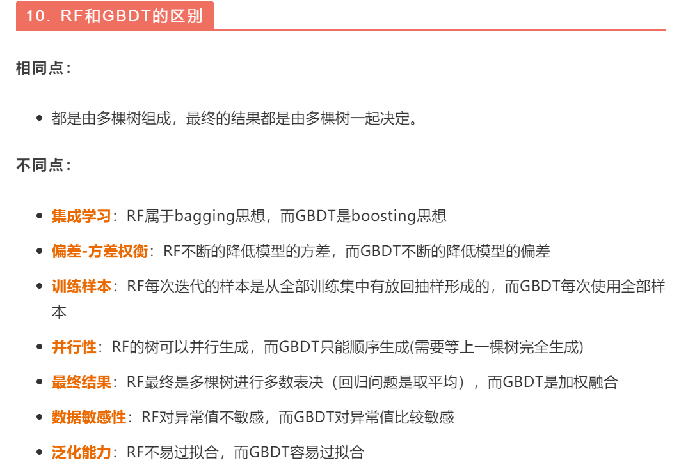

# 使用说明

题目之来源: <https://www.nowcoder.com/discuss/33737>

斜体字的是直接抄上面网页的. 

引用来源已以最大限度标注. 

此文乃徒自益尔, 言语甚鄙, 不求甚解, 万望阅者谅解. 如有谬误, 敬请指正. 

## Boost算法

AdaBoost, GBDT, XGBoost等. 

核心集成思想是Boost, 是一种基于错误的算法, 比如试图重点关注错分的对象, 用后续的模型找补之前的错误. 

## CART

*回归树用平方误差最小化准则，分类树用基尼指数最小化准则.*

基尼系数: 能够表示一堆数据里面任抽俩, 它俩不同分类的概率是多少. 反映了一个样本集合的纯度, 基尼系数越小越纯. 

## GBDT与随机森林比较

[来源](https://mp.weixin.qq.com/s?__biz=MzI1MzY0MzE4Mg==&mid=2247485159&idx=1&sn=d429aac8370ca5127e1e786995d4e8ec&chksm=e9d01626dea79f30043ab80652c4a859760c1ebc0d602e58e13490bf525ad7608a9610495b3d&scene=21#wechat_redirect)

相同点：
* 都是由多棵树组成，最终的结果都是由多棵树一起决定。

不同点：
* 集成学习：RF属于bagging思想，而GBDT是boosting思想
* 偏差-方差权衡：RF不断的降低模型的方差，而GBDT不断的降低模型的偏差
* 训练样本：RF每次迭代的样本是从全部训练集中有放回抽样形成的，而GBDT每次使用全部样本
* 并行性：RF的树可以并行生成，而GBDT只能顺序生成(需要等上一棵树完全生成)
* 最终结果：RF最终是多棵树进行多数表决（回归问题是取平均），而GBDT是加权融合
* 数据敏感性：RF对异常值不敏感，而GBDT对异常值比较敏感
* 泛化能力：RF不易过拟合，而GBDT容易过拟合

来源忘了. GBDT是降低Bias, RF是降低variance. 

<!--  -->

## GBDT

*利用损失函数的负梯度在当前模型的值作为回归问题提升树算法中的残差的近似值，拟合一个回归树.*

GBDT跟XGBoost没什么本质区别. 后者在一些细节上优化了. 如损失函数进行了二阶泰勒展开、目标函数加入正则项、支持并行和默认缺失值处理等，在可扩展性和训练速度上有了巨大的提升. [来源](https://mp.weixin.qq.com/s?__biz=MzI1MzY0MzE4Mg==&mid=2247485159&idx=1&sn=d429aac8370ca5127e1e786995d4e8ec&chksm=e9d01626dea79f30043ab80652c4a859760c1ebc0d602e58e13490bf525ad7608a9610495b3d&scene=21#wechat_redirect)

## 